# Arduino STM32 HID 烧录方式 环境搭建 #

## 1、下载必要的文件 ##
- Stm32cube programmer(用来烧录引导程序即bootloader的软件)
- [开发板支持](https://github.com/stm32duino/Arduino_Core_STM32)
- HID引导程序bootloader（需要烧录的引导）
## 2、安装Arduino ##
- 打开**arduino-1.8.13-windows.exe** 进行安装
- 最好选择默认文件夹（不要改）
- 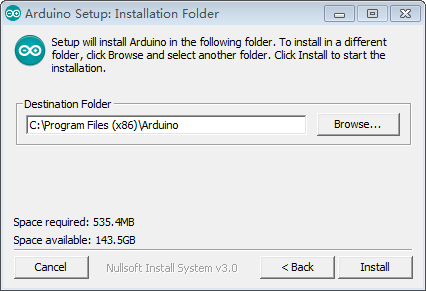

## 3、配置STM32 开发板环境 ##
- 打开Arduino首选项
- 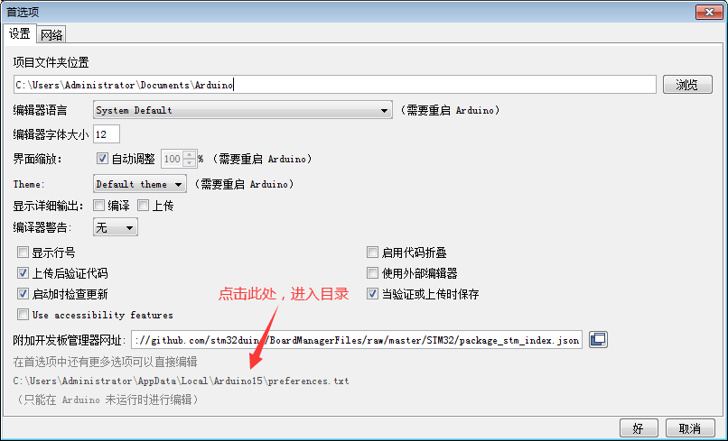
- 打开STM32.zip，将里面所有内容解压到此处
- 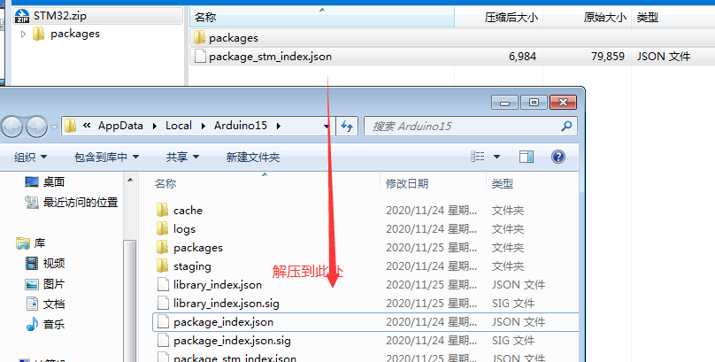
- 重启Arduino
- 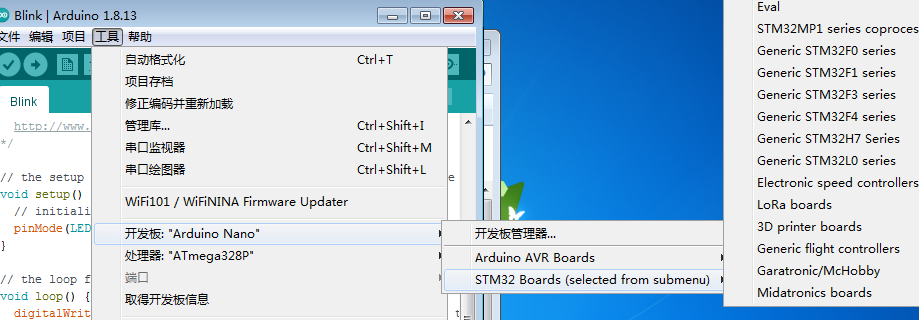

## 4、安装STM32Cube Programmer ##
- 打开**SetupSTM32CubeProgrammer_win64.exe**进行安装
- （一路Next，提示安装的点安装）
- 安装不了自行百度

## 5、烧录bootloader ##
- 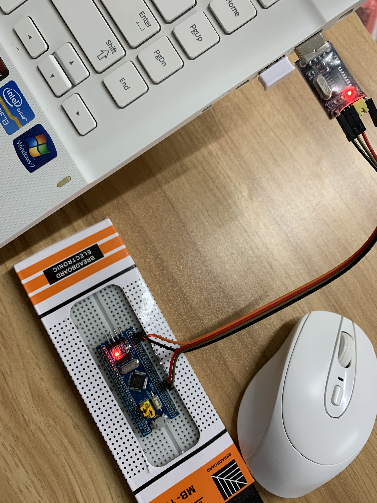
- 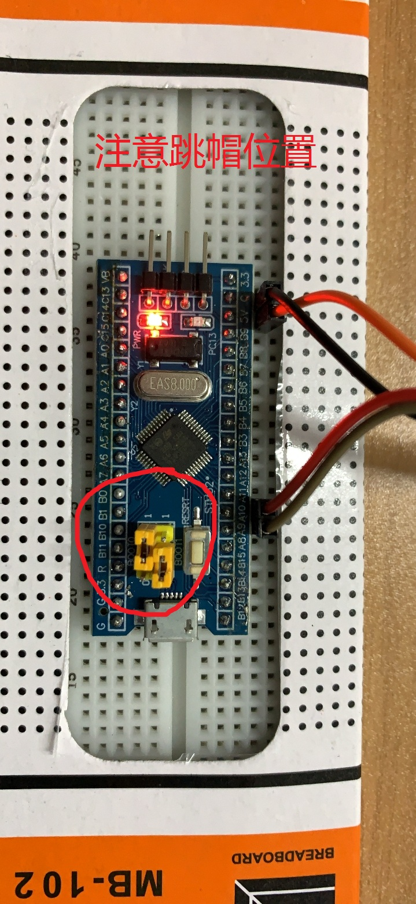
- 插入电脑识别到ch340（若未识别，右键更新驱动，自动更新）
- 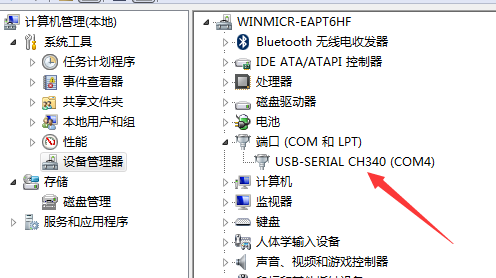

- 打开STM32CubeProgrammer
- 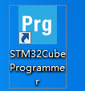
- 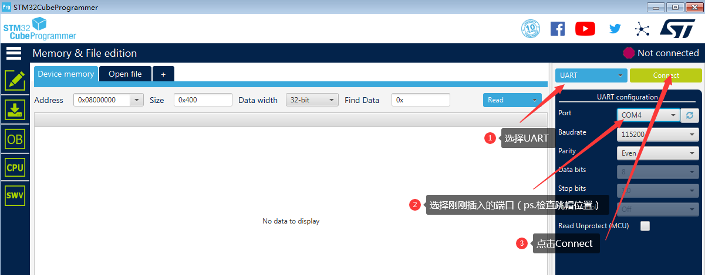
- 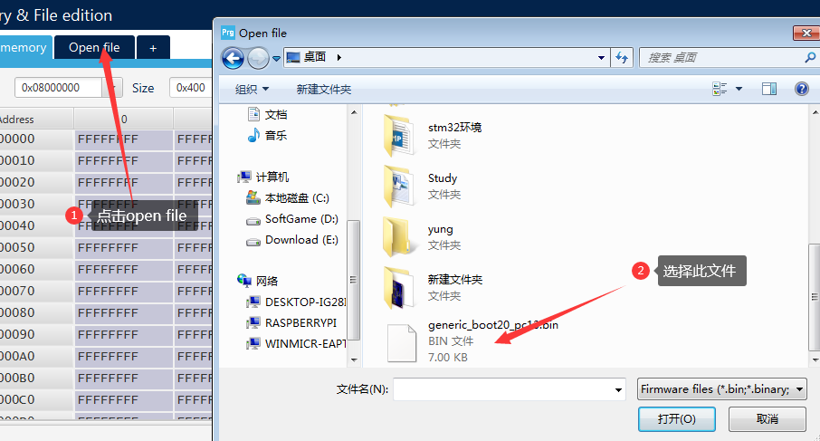
- 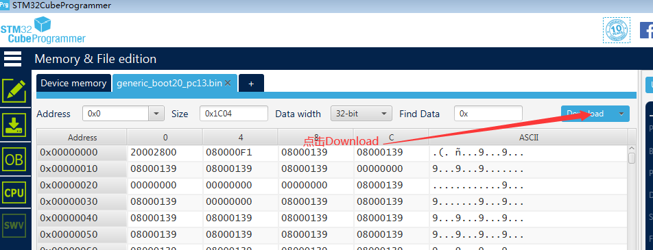

## 6、上传代码 ##
- 把跳线帽插回原来的位置
- 将USB数据线连接至电脑;
- 
- 选择示例blink;
- 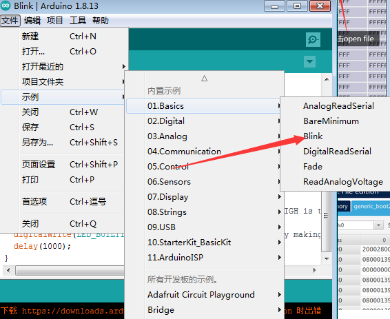
- 如图设置开发板选项;
- 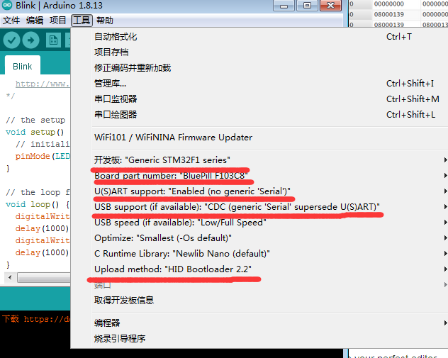
- 上传代码（不需要选择端口）
- 上传一次代码后，重新插入STM32，会出现一个端口
- 后续上传代码之前需要选择端口

# 除了hid方式 [这里](https://github.com/stm32duino/Arduino_Core_STM32)也提到很多方式都可以进行下载 #
